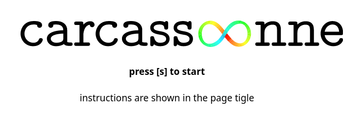
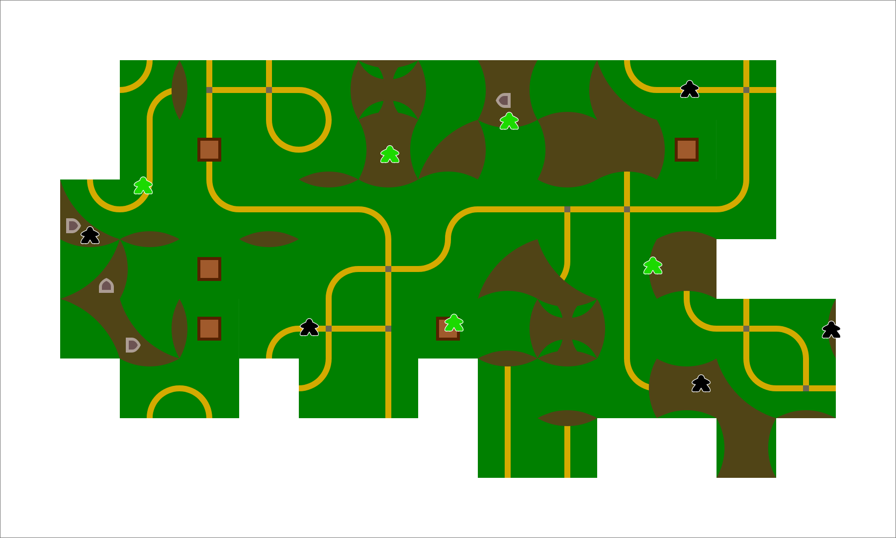
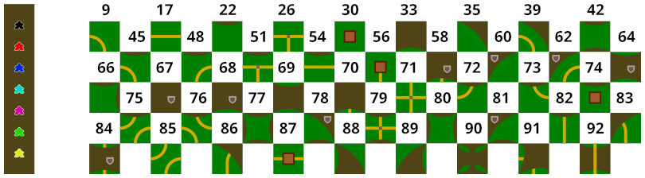

Infinite Carcassonne.

[▶ P L A Y ◀](https://illdepence.github.io/carcassoonne/)

## Features

* placing of meeples and tiles
* removing of meeples
* turn taking of players
* automatically adjusting game field size
* seamless zoom due to SVG tiles

## Playing material

* 45 different tiles
* 7 player colors
* infinite playing field

